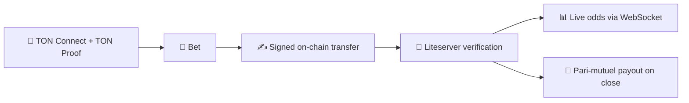

# TonMarket 🎯

**Bet on real-world outcomes with TON.** TonMarket is a prediction market built for Telegram: a Vue 3 Mini App frontend and a Go backend where users connect a TON wallet, stake TON on binary outcomes — politics, crypto, culture — and get paid on-chain when they're right. Winners split the losing pool.

<p>
  
  
  
  
  
  
</p>

## How it works

1. **Connect & prove** — TON Connect with a full **TON Proof** handshake: the backend cryptographically verifies wallet ownership before issuing a JWT session.
2. **Browse markets** — a live feed of binary events with tag filters, infinite scroll and odds that update in real time.
3. **Bet** — pick an amount (input + slider synced to your live wallet balance) and sign the transfer in your own wallet. The deal ID travels on-chain as the transfer comment; the server never touches user keys.
4. **On-chain verification** — a background worker polls TON liteservers, matches the incoming payment by its comment, confirms the deal and broadcasts fresh odds to every client over WebSocket.
5. **Payouts** — when an event resolves, winners receive a **pari-mutuel** share of the losing pool straight to their wallets, with a delivery-verification retry loop.



## Engineering highlights

- **Trust-minimized deposits**: bets are ordinary TON transfers signed by the user's own wallet; a position is credited only after the backend verifies the transaction directly on-chain — raw liteserver access via `tongo`, no third-party indexer.
- **Real-time odds**: push-only WebSocket fan-out to all connected clients the moment a deposit confirms.
- **Read/write decoupling**: market odds are recomputed into an in-memory snapshot every 5 seconds, so the feed endpoint never blocks on hot state.
- **Concurrency-safe market engine**: layered `RWMutex` state plus buffered channels driving background workers for deposit verification and payout-delivery retries.
- **On-chain settlement**: pari-mutuel math resolved per event, paid out from a HighLoad wallet with confirmation checks against chain history.
- **Polished mobile UI**: custom dark theme, skeleton loaders, toast notifications, keep-alive routing, bet-sizing slider bound to the live balance.

## Stack

| Layer | Tech |
|---|---|
| Backend | Go 1.23 · Echo · pgx / PostgreSQL · tongo (liteapi, tonconnect, wallet) · WebSocket |
| Frontend | Vue 3 · TypeScript · Vite · Vuetify · Pinia · TON Connect UI |
| Infra | Docker Compose (Postgres + client + server) · TLS via Let's Encrypt |

## Running

```bash
cp .env.example .env        # secrets: wallet seed, admin key, DB password
docker compose up --build   # Postgres + client build + Go API (TLS, port 443)
```

For local development: start the server on `:8081`, then `npm run dev` in `client/` — Vite proxies `/api` and `/ws` to it.

> **Status:** MVP built in ~3 weeks by a team of two. The full money path — wallet auth → bet → on-chain verification → live odds → payout — works end to end; event creation/resolution is admin-driven and some screens are stubs.

---

Built by [Maksim Panchuk](https://github.com/maxim-panchuk) and [a-zelenkov](https://github.com/a-zelenkov).
